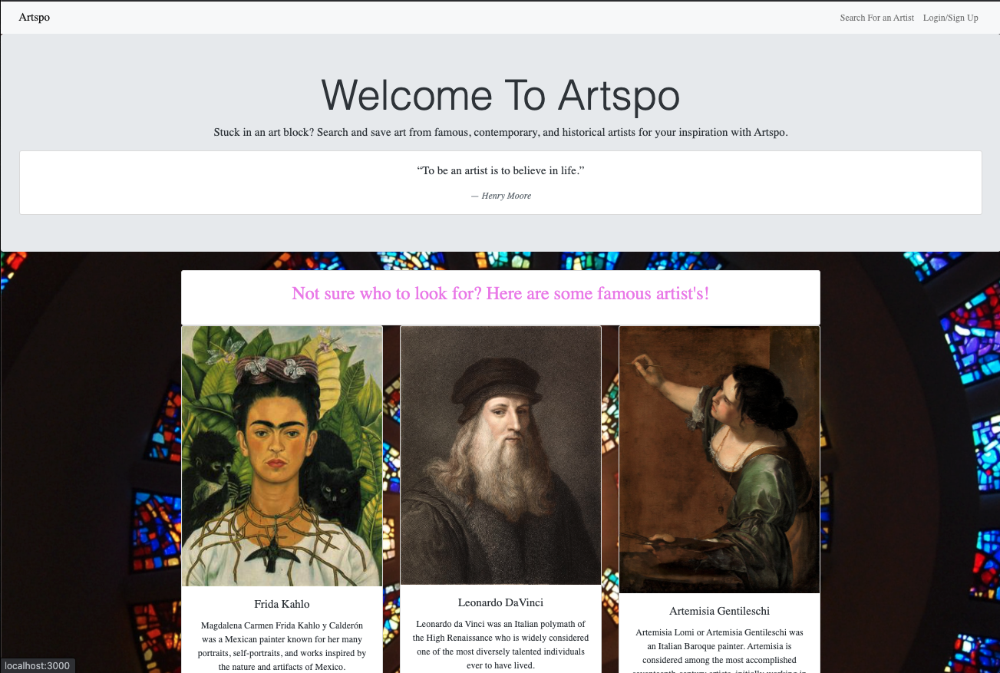
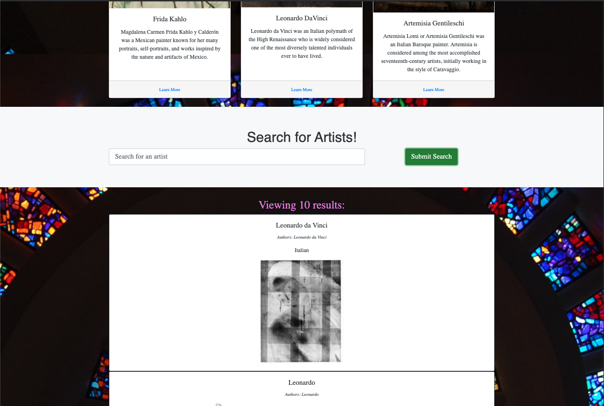
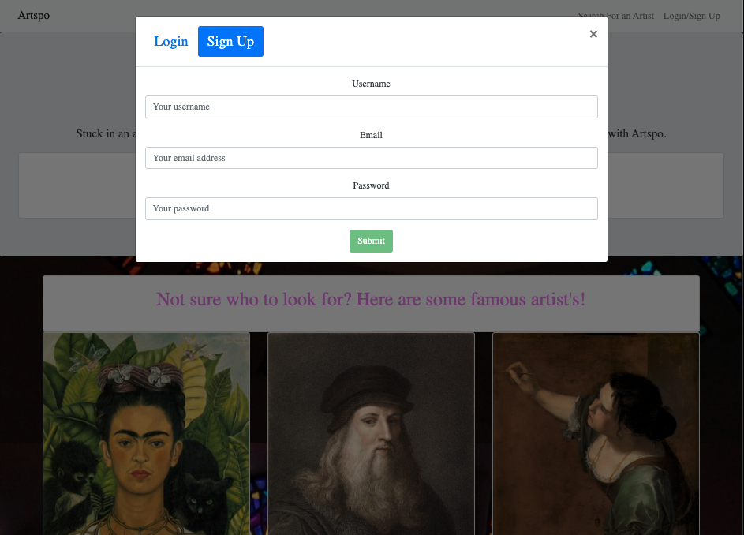

# {Artspo}

## Table of Contents
* [User Story](#user-story)
* [Usage](#usage)
* [Criteria](#criteria)
* [Technologies](#technologies)
* [Screenshots](#screenshots)
* [Links](#links)
* [Mockup](#mockup)
* [License](#license)

## User Story
If you're an inspiring artist, creative, or just curious about how or why
anyone would care about art, begin your journey here. Search for an artist to learn 
more about what they did, who they are, and how they made an impression in the world. Find your
art inspiration with Art-Spo.  
I WANT an webpage that can give artists inspiration from other artists of art work and make a donation.  
SO WHEN I search for a painting it will display image, description and able to save favorite art paintings. 

## Usage
Art-spo works as a full-stack MERN appliaction with both client and server side. 
A user can aearch for an artist by name and recive a card list of items featureing the all artist with said common name,
what culture they are from and influenced by, and an image of their works with and imbeded url. 
All reults are provided by the Harvard Museum of Art API. 
A user should also be able to login and save their search results by clicking on the list items and is saved to thier own Saved Artist Dashboard.
They can access the their search saved history of artist from there. 

## Criteria
WHEN I load the search engine to Artspo  
THEN I am presented with the homepage with links to follow with social media, Login/Signup and an input field to search for artists work  
WHEN I search for an artist work in the navbar not logged in  
THEN I am presented with several results of the artist work with an image and description   
WHEN I click on the Login/Signup form  
THEN a modal appears on the screen with a toggle between the option to log in or sign up  
WHEN I am signing up for an account  
THEN I am presented with inputs for a username, an email address, and a password, and a signup button  
WHEN I enter a valid email address and create a password and click on the signup button  
THEN my user account is created and I am logged in to the site  
WHEN I am logged in to the site with my account  
THEN the navbar change to search for artist, make a donation, save favorite art work and Logout  
WHEN I am logged in searching for artist  
THEN I am presented with image with artist work for inspiration and a button to save artwork to my account  
WHEN I click on the save button on artwork  
THEN that artist work is saved to my account  
WHEN I click on the option to see my saved artwork  
THEN I am presented with every artist artwork saved to my account and a button to remove from my account  
WHEN I click on the remove button on artwork  
THEN that artist artwork is deleted from my saved arts list  
WHEN I click on the Logout button  
THEN I am logged out of the site and presented with the homepage of the login/signup form  

## Screenshots

#### Landing Page

#### Searching for Artist List 

#### User Login and Signup

## Technologies
1. Mongoose 
2. MogoDB 
3. JavaScript
4. Express
5. React
6. Apollo
7. Graphlq
8. Harvard Museum of Art API

## Mockup

## Contact 
Visit our **[GitHub profiles](https://github.com/Aken00/) (https://github.com/amanduke) (https://github.com/Champion113)** 
to check out this and other projects.

## links 
- **[Github Repo](https://github.com/Aken00/art-spo)
- **[Deployed App](https://art-spo.herokuapp.com/)

## License  
    
  This app is licensed under the MIT license.
